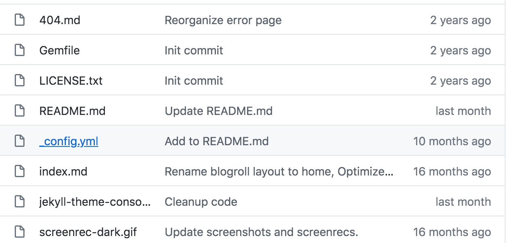
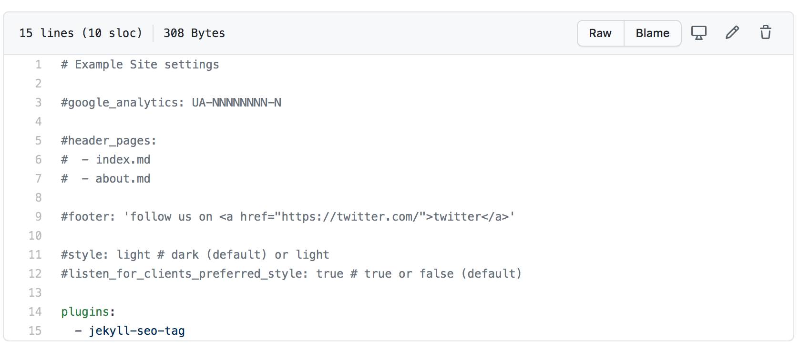
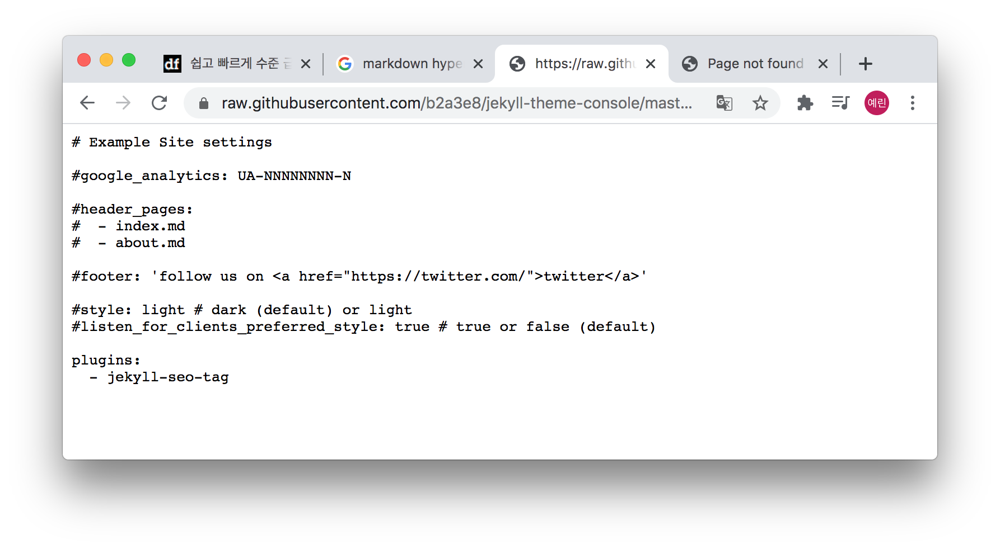
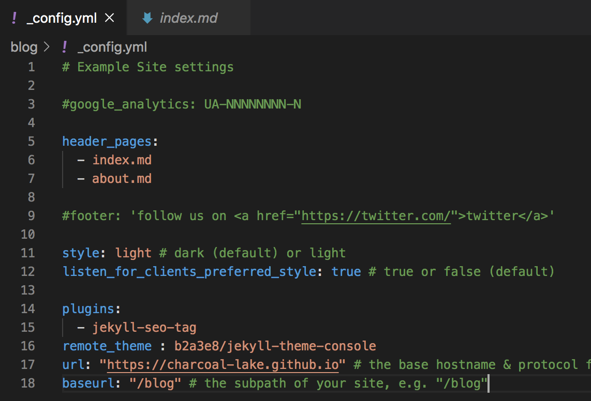
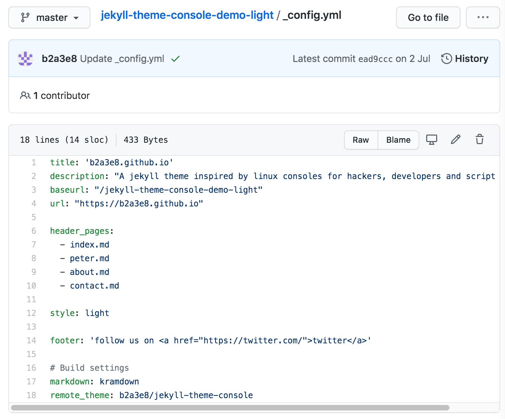
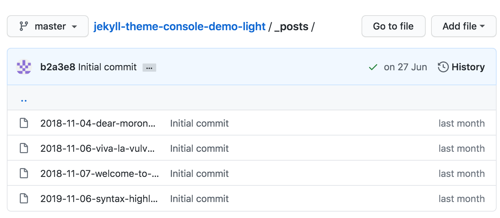
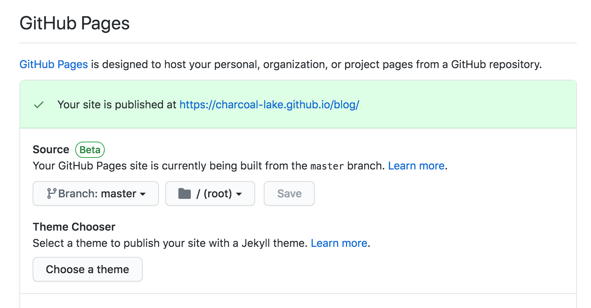
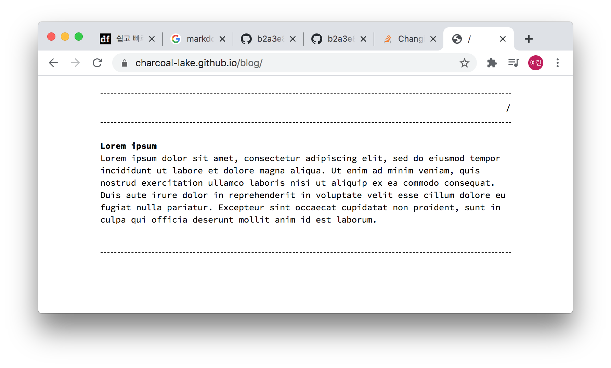

<h1>Table of Contents</h1>

<ul class="toc-item"><li><a href="#Jekyll" data-toc-modified-id="Jekyll-1">1&nbsp;&nbsp;Jekyll</a><ul class="toc-item"><li><a href="#repository,-jekyll-테마" data-toc-modified-id="repository,-jekyll-테마-1.1">1.1&nbsp;&nbsp;repository, jekyll 테마</a></li><li><a href="#_config.yml-파일-가져오기" data-toc-modified-id="_config.yml-파일-가져오기-1.2">1.2&nbsp;&nbsp;<code>_config.yml</code> 파일 가져오기</a></li><li><a href="#config-구성" data-toc-modified-id="config-구성-1.3">1.3&nbsp;&nbsp;config 구성</a></li><li><a href="#추가-옵션" data-toc-modified-id="추가-옵션-1.4">1.4&nbsp;&nbsp;추가 옵션</a></li><li><a href="#publish" data-toc-modified-id="publish-1.5">1.5&nbsp;&nbsp;publish</a></li></ul></li><li><a href="#jupyter-notebook-을-블로그로-옮겨보자" data-toc-modified-id="jupyter-notebook-을-블로그로-옮겨보자-2">2&nbsp;&nbsp;jupyter notebook 을 블로그로 옮겨보자</a></li></ul>

# Github 블로그 만들기

jekyll을 사용하여 github.io 로 끝나는 블로그를 만들어보자 :D

## Jekyll

* 참고자료 : [쉽고 빠르게 수준 급의 GitHub 블로그 만들기 - jekyll remote theme으로](https://dreamgonfly.github.io/blog/jekyll-remote-theme/)

### repository, jekyll 테마

블로그로 사용할 레포를 만든다. 나는 이미 만들어둔 `/blog` 레포를 사용하였으나, 평소에 레포를 만들던대로 만들면 된다.

다음으로 원하는 jekyll 테마를 github에서 찾는다.  https://github.com/topics/jekyll-theme

나는 이 테마를 선택하였다. https://github.com/b2a3e8/jekyll-theme-console

### `_config.yml` 파일 가져오기

모든 jekyll 테마에는 `_config.yml` 이라는 파일이 있다. 이 파일을 열어 `raw` 버튼을 누르면 전체를 복사할 수 있게 된다. 파일을 복사하여 나의 로컬 레포지토리 폴더에 새 파일을 만든 뒤 붙여넣고, `_config.yml`로 저장한다.

위와 같이 만들었다.

### config 구성

Remote Theme 을 사용할 때에는 `_config.yml`에 `remote_theme`, `url`, `baseurl` 라인을 추가해주어야 한다. 나의 예시의 경우에는 다음과 같이 추가된다.

`
remote_theme: b2a3e8/jekyll-theme-console
url: "https://charcoal-lake.github.io"
baseurl: "/blog"
`

이 부분은 자신이 선택한 테마과 자신의 아이디에 따라

`
remote_theme: owner/repositoryname
url: "https://yourid.github.io"
baseurl: "/yourreposname"
`

과 같이 추가해주면 된다.

수정한 결과는 위와 같다. 추가된 라인은 코드 어디에 넣어도 상관없는 듯 하다.

### 추가 옵션

보통은 테마의 `README.md` 파일에 어떻게 설치를 하면 되는지 자세히 설명이 나와있다. 이 파일의 설명과 상단 참고자료의 링크를 참조하면 쉽게 설치할 수 있다. 나의 경우 `README.md`에 테마에 대한 옵션이 있어 이를 추가해주었다.

또는 페이지 구성이 어떻게 이루어지는, 어디에 포스트를 넣으면 되는지 헷갈리는 경우를 위해 보통 개발자들이 샘플 페이지를 올려둔다. 나는 이 샘플페이지를 참고하여 만들었다. https://github.com/b2a3e8/jekyll-theme-console-demo-light

샘플페이지를 참고하여 `_config.yml`의 구조와 전체적인 레포의 구조를 참고한다.

### publish

repository의 settings에서 GitHub Pages 옵션으로 이동하여 master 브랜치에 사이트를 publish 해주자.

페이지가 준비되면 위와같이 초록색으로 변하고 puslish가 되었다고 나온다. 바로 링크를 눌러 테스트해본다.

성공 \\(^0^)/ !!

## jupyter notebook 을 블로그로 옮겨보자

jupyter notebook을 마크다운 파일 또는 html 파일로 변경하기 위해서는 먼저 `nbconvert`를 설치해야 한다.

https://github.com/jupyter/nbconvert

