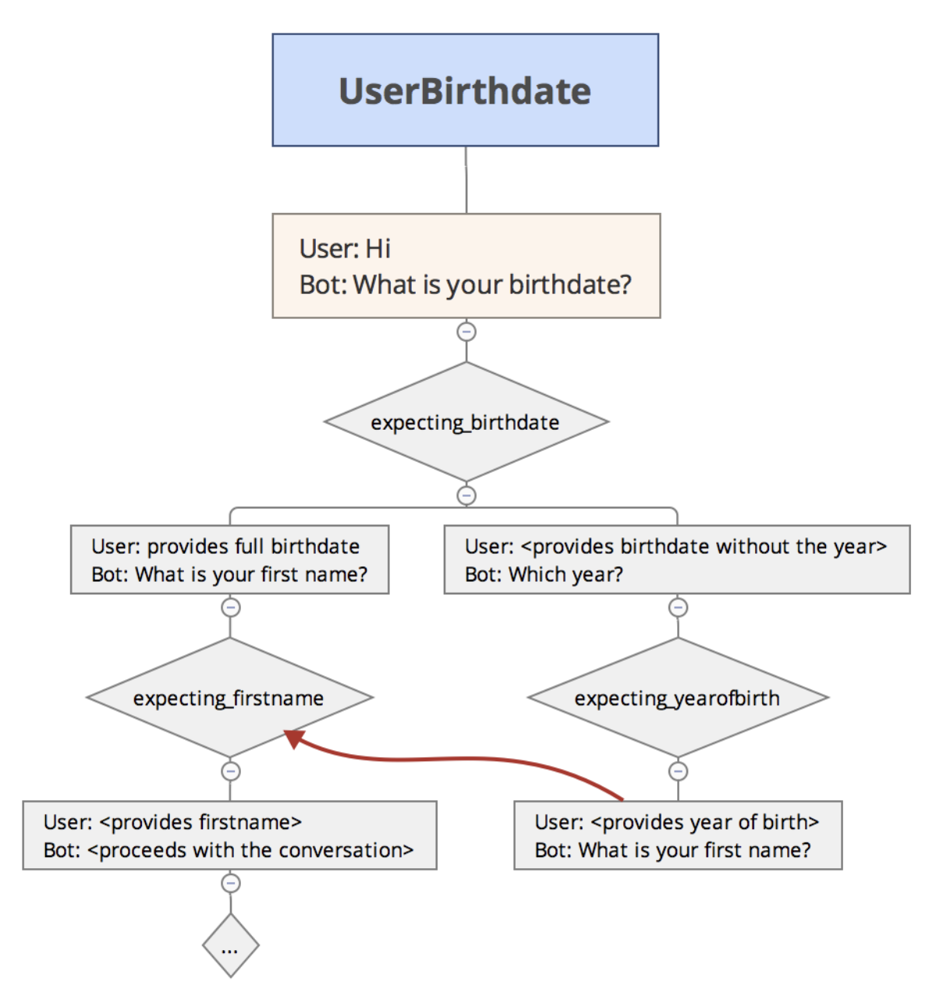

###2020-07-20 Event

* welcome event 같이 사용자 query가 없는 상태에서 intent를 불러오거나
* happy path가 아닌 대화가 발생할 때 다른 intent로 건너뛰기 위해 사용




### Intent에 event 지정
```
{
  "id": "6a3437fb-3728-432b-b872-0586540af92d",
  "name": "00010-problemIntent",
  "auto": true,
  "contexts": [],
  "responses": [
    {
      "resetContexts": false,
      "action": "ask_data.productname",
      "affectedContexts": [
        {
          "name": "00010-problemIntent-followup",
          "parameters": {},
          "lifespan": 2
        }
      ],
      "parameters": [
        {
          "id": "99b150a6-5fcb-47bf-ab9f-5300372e9d75",
          "required": false,
          "dataType": "@productname",
          "name": "productname",
          "value": "$productname",
          "promptMessages": [],
          "noMatchPromptMessages": [],
          "noInputPromptMessages": [],
          "outputDialogContexts": [],
          "isList": false
        }
      ],
      "messages": [
        {
          "type": 0,
          "lang": "ko",
          "condition": "",
          "speech": [
            "어느 날로 예약을 하시겠습니까?",
            "지금은 수리가 안되고 예약해야 합니다. 언제가 좋으신가요?",
            "예약이 필요합니다. 날짜를 알려주세요.",
            "언제 수리를 하실 수 있나요?"
          ]
        }
      ],
      "defaultResponsePlatforms": {},
      "speech": []
    }
  ],
  "priority": 500000,
  "webhookUsed": true,
  "webhookForSlotFilling": false,
  "fallbackIntent": false,
  "events": [
    {
      "name": "ask_date"
    }
  ],
  "conditionalResponses": [],
  "condition": "",
  "conditionalFollowupEvents": []
}
```

### Webhook으로 event trigger (followup event)
mockable.io 에서 dummy response 생성하여 trigger
```
{
    "followupEventInput":{
        "name":"ask_date"
    }
}
```

webhook response 형식
```
{
  "followupEventInput": {
    "name": "event-name",
    "parameters": {
      "parameter-name-1": "parameter-value-1",
      "parameter-name-2": "parameter-value-2"
    },
    "languageCode": "en-US"
  }
}
```
"`WebhookResponse`에 `followupEventInput` 매개변수가 설정된 경우 Dialogflow는 `fulfillmentText`, `fulfillmentMessages`, `payload` 필드를 무시합니다. Dialogflow에서 이벤트가 포함된 웹훅 응답을 받으면 정의된 해당 인텐트를 즉시 트리거합니다. "


[https://www.mockable.io/]()


### 파이썬 api로 event trigger (welcome event)
* query_input에 query 대신 event 를 넘겨서 trigger
* parameter는 struct 타입

```
import dialogflow
from google.protobuf import struct_pb2

session_client = dialogflow.SessionsClient()
session = session_client.session_path(project_id, session_id)

parameters = struct_pb2.Struct()
parameters["given-name"] = 'Jeff'
parameters["last-name"] = 'Bridges'

query_input = {
    'event': {
        "name": "greetPerson",
        "parameters": parameters,
        "language_code": "de"
    }
}

response = session_client.detect_intent(
    session=session,
    query_input=query_input)
```


[https://cloud.google.com/dialogflow/docs/events-overview?hl=ko]()

[https://medium.com/@jwlee98/gcp-dialogflow-%EB%A5%BC-%EC%9D%B4%EC%9A%A9%ED%95%9C-%EA%B0%84%EB%8B%A8-%EC%B1%97%EB%B4%87-%EB%A7%8C%EB%93%A4%EA%B8%B0-3%ED%83%84-event-50ee752add4f]()

[https://stackoverflow.com/questions/54197528/set-parameters-in-eventinput-in-dialogflow-v2-api]()

[https://cloud.google.com/dialogflow/docs/quick/api?hl=ko]()
